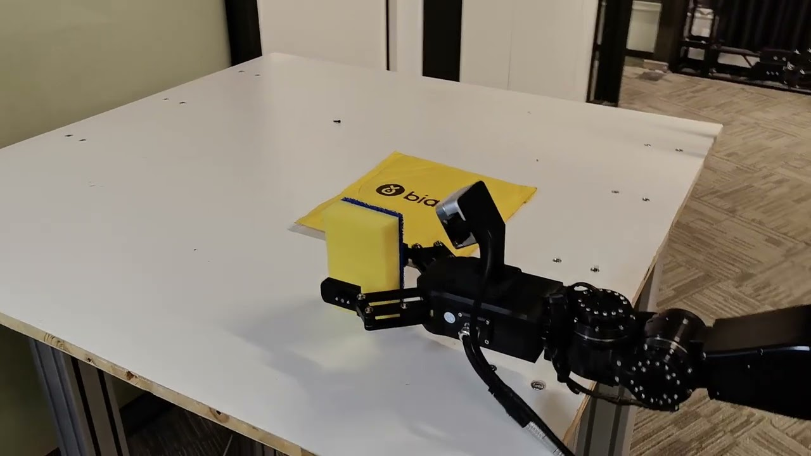

# Dora-OpenLoong

> 本项目旨在将 `Dora-rs` 生态与 `OpenLoong SDK` 进行深度融合


## 项目描述

本项目基于[青龙全尺寸人形机器人平台](https://www.openloong.org.cn/cn/documents/robot/product_introduction)，使用 `dora-rs` 构建了一个多模态（RGB-D摄像头、语音输入、视觉语言模型、机器人控制）的机器人系统，旨在探索AGI通用具身智能应用，开发智能机器人帮助物流和服务业务。系统包括：

- 感知层
  - 采用 RealSenseAI D435 RGB-D 相机和麦克风阵列进行环境感知，捕捉图像和声音流数据

- 处理层
  - 图像分割、语音识别和视觉语言处理。我们使用 `SAM2`、`Distil-Whisper-Large`和 `QwenVL-3`模型分别完成了对图像分割、语音识别和决策任务的实现

- 控制层
  - 利用状态机机制管理机器人的动作和状态，根据环境的情况和语音命令决定机器人采取何种动作

- 输出层
  - 执行器控制部分通过双臂机械手实现系统对环境的操作，通过 `rerun` 显示当前机器人的状态及执行流程的实时图形界面

## 实例数据流架构展示

```terminal
dora-openloong
├── apis  # dora api
├── binaries  # dora 核心组件
│   ├── cli
│   ├── coordinator
│   ├── daemon
│   └── runtime
├── compute
│   └── pyorbbecsdk  # 奥比中光相机驱动
├── docker  # docker 镜像
│   └── slim
├── examples  # 实例数据流
│   └── loong
├── libraries  # 工具
├── node-hub  # Node Hub 节点坞
│   ├── dora-distil-whisper  # Whisper 节点
│   ├── dora-microphone  # 麦克风节点
│   ├── dora-object-to-pose  # pnp 节点
│   ├── dora-pyorbbecksdk  # 奥比中光节点
│   ├── dora-pyrealsense  # realsense 节点
│   ├── dora-qwen2-5-vl  # Qwen VLM 节点
│   ├── dora-record  # 录音节点
│   ├── dora-rerun  # rerun.io 可视化节点
│   ├── dora-sam2  # SAM2节点
│   ├── dora-vad  # 音频分割节点
│   ├── loong-realsense2  # 实例数据流使用的 realsense 节点
│   └── terminal-input  # 终端输入节点
└── sdk
    ├── loong_sim_sdk_release  # OpenLoong 青龙机器人驱动
    └── loong_sim_sdk_rust     # OpenLoong 青龙机器人驱动 Rust 实现
```

## 如何开发

### Notice

1. 需要安装 `rust` 环境 (在 `rust-toolchain.toml` 中进行描述)
2. 推荐使用 `uv` 工具来管理 `python` 项目及包管理，详情见 [astral-uv](https://docs.astral.sh/uv/)
3. 使用 `realsense` 或者 `orbbec` 深度相机时候，需要提前安装对应厂家提供的驱动程序，并在数据流中选择对应的节点，如有其他品牌相机开发需求，可以自己实现对应相机取图的节点（参考[realsense示例节点](node-hub/loong-realsense2/realsense.py)）
4. 需要安装 `dora-cli` 工具，详情见 [dora-ai](https://dora-rs.ai/?current-os=pip)（推荐使用 2 中的 `uv` 进行安装）
5. 需要安装 `sdk/openloong_sim_sdk_release` 项目所需的所有依赖
6. 首次运行需要从 `Hugging Face` 中缓存 `Whisper` 语音模型至本地，从 `Model Space` 中缓存 `Qwen3-VL` 模型至本地，需要较长的初始化时间，并且需要确保特殊网络环境访问 [Hugging Face](https://huggingface.co/)
7. 为确保运行成功率，建议提前缓存模型至本地，并配置节点 `dora-distil-whisper` 和 `dora-qwen2-5-vl` 中的环境变量 `DEFAULT_PATH` 为模型本地路径

```shell
git clone https://github.com/XiaoPengYouCode/dora-openloong
cd dora-openloong
dora build example/loong/pick-place.yml
dora run example/loong/pick-place.yml
```

## 项目运行演示

点击图片跳转查看

[](https://www.youtube.com/watch?v=iJJ_26oG5OA)
